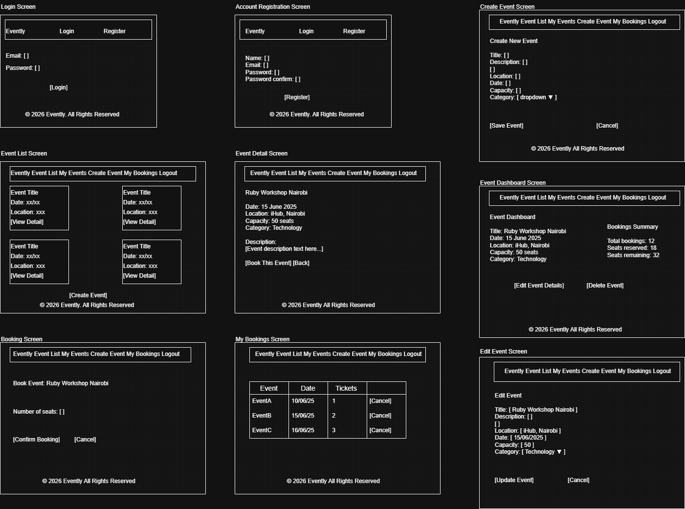
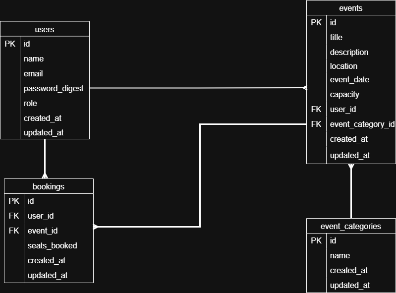
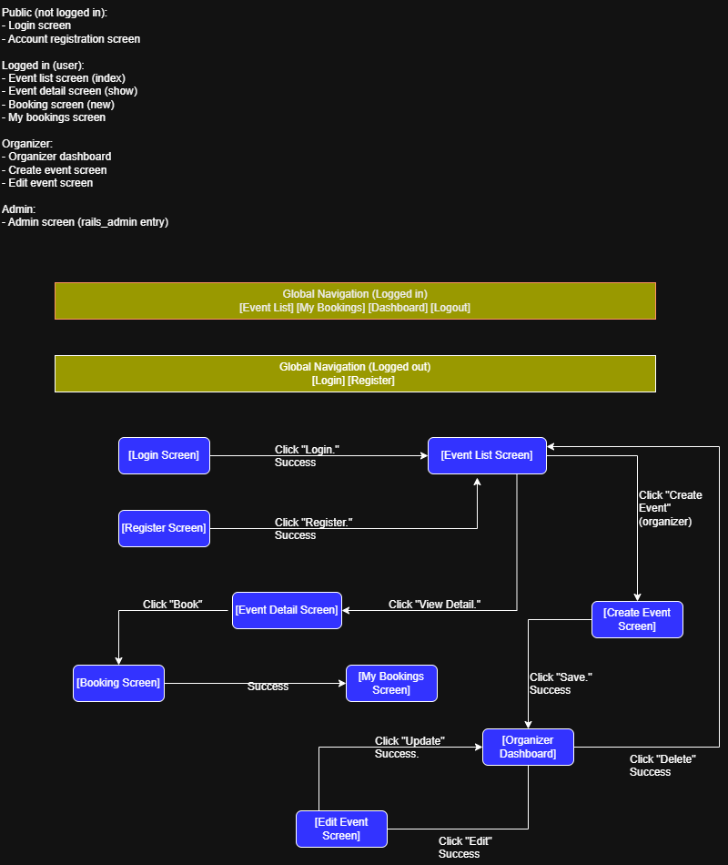

# Evently

A web-based event booking system that allows users to discover, view, 
and book events such as seminars, workshops, and community gatherings 
in one centralized platform.

---

## Development Language and Framework

- Ruby: 3.3.0
- Rails: 6.1.7.7
- Database: PostgreSQL 16
- Testing: RSpec
- CSS: Bootstrap 4

---

## Application Setup Instructions

```bash
git clone https://github.com/Owens345/evently.git
cd evently
bundle install
rails db:create
rails db:migrate
rails s
```

Then open your browser and go to:
http://localhost:3000

---

## Design Documents

### Check Sheet
[View Check Sheet](https://docs.google.com/spreadsheets/d/1M9wNf89fHjj219as-t_WkGQKKnXfZujJzRS15Lm6PmI/edit?usp=sharing)

### Catalog Design
[View Catalog Design](https://docs.google.com/spreadsheets/d/1M9wNf89fHjj219as-t_WkGQKKnXfZujJzRS15Lm6PmI/edit?usp=sharing)

### Table Definition
[View Table Definition](https://docs.google.com/spreadsheets/d/1M9wNf89fHjj219as-t_WkGQKKnXfZujJzRS15Lm6PmI/edit?usp=sharing)

### Wireframe


---

## ER Diagram



---

## Screen Transition Diagram


